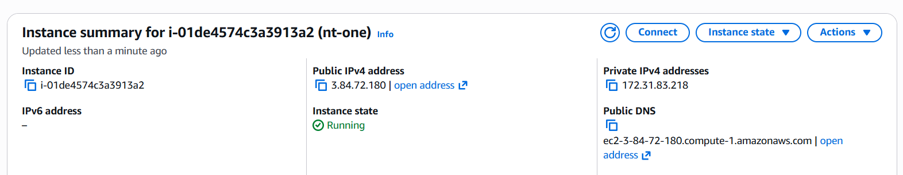
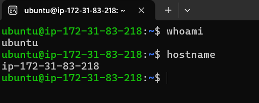
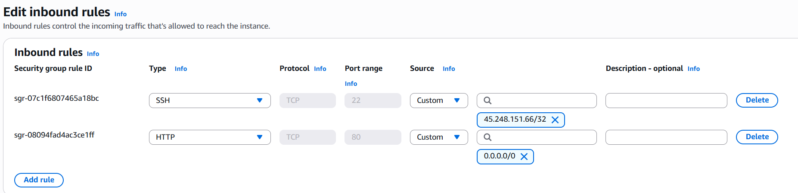
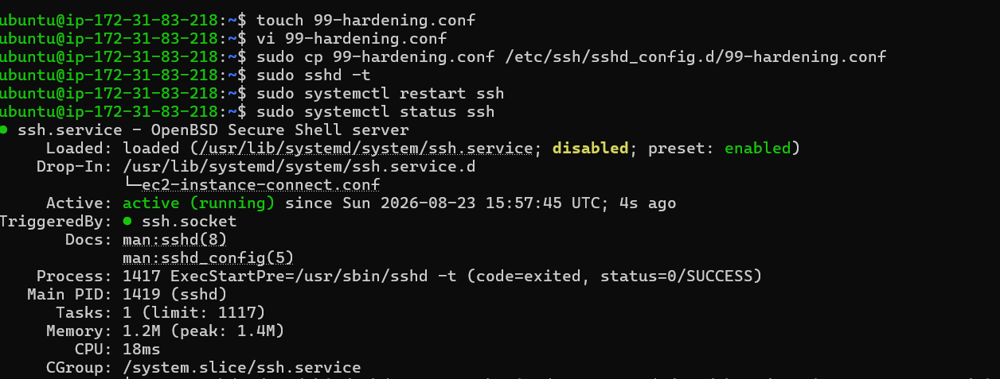
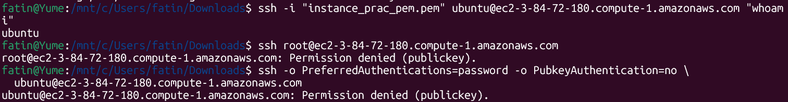
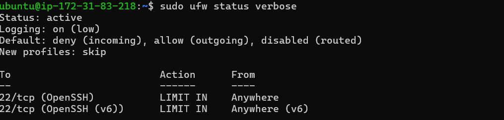
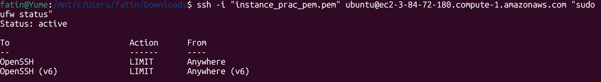

# AWS EC2 Security Practice Lab

Hands-on lab covering EC2 launch, Security Groups, and basic Linux
hardening (SSH + UFW).

## Objectives

1. Launch an EC2 instance
2. Restrict access with a Security Group (SSH from your IP only)
3. Harden SSH (key-only auth, no root login)
4. Configure UFW as a host-level firewall

## Key security principles applied

- **Network defense in depth** — Security Group (stateful, instance-level,
  AWS-managed) + UFW (host-level, OS-managed) both restrict traffic.
- **Reduced SSH attack surface** — key-based auth only, no root login, SSH
  restricted to a single known source IP at the Security Group layer.

## Screenshots

